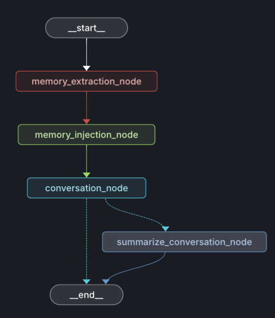
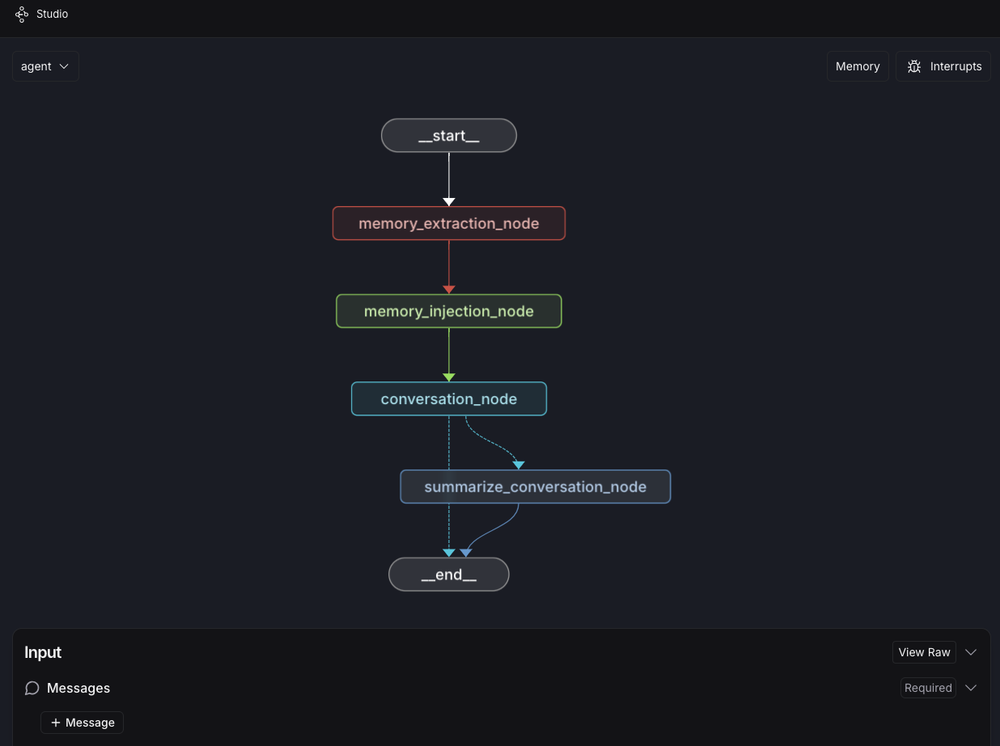
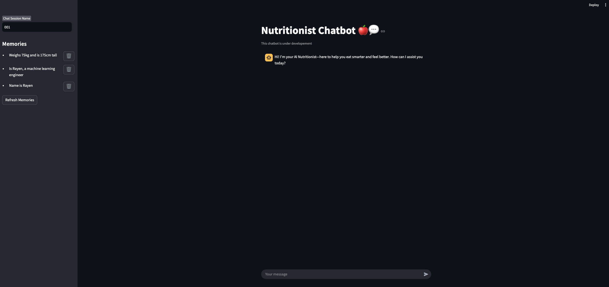

<h1 align="center" style="border-bottom: none;">AI Nutritionist Chatbot</h1>

## **Overview**

The AI Nutritionist Chatbot is an intelligent assistant designed to provide personalized nutrition advice. It leverages LLMs (Large Language Models) for contextual understanding and long-term memory retention. The chatbot integrates with WhatsApp for seamless interaction and includes a user-friendly UI built with Streamlit.

The Nutritionist chatbot's brain looks as follows:

|  |
| :---------------------------------------: |
|    Figure 1: Langgraph's chatbot graph    |

---

## **Prerequisites**
* **Python 3.12**
* **Poetry**: For dependency management.
* **Docker**: Refer to [Docker's documentation](https://docs.docker.com/engine/install/) to install Docker Desktop.
* **VSCode**: For local development and testing, download and install [VSCode](https://code.visualstudio.com/). 
* **Make**: For simplified command execution.

## **Features**
* **Conversational AI**: Provides nutrition guidance through natural language interactions.
* **Long-Term Memory**: Stores and retrieves relevant past conversations for improved context.
  * **Memory extraction**: Identifies and extracts key information from user conversations.
  * **Memory injection**: Dynamically integrates relevant memories into the chatbot's brain.
  * **Memory summarization**: Condenses and organizes stored conversations for efficient context management.
* **User Interface**: Developed using Streamlit for an intuitive and interactive experience.
* **Memory Management UI**: Allows users to visualize and delete stored memories.
* **WhatsApp Integration**: Enables users to chat via WhatsApp _(still under development)_.
* **Docker Deployment**: Containerized using Docker and managed with Docker Compose.

## **Technologies Used**
- **Langgraph**: For orchestrating conversational flows and AI agents.
- **Qdrant DB**: Vector database for efficient memory storage and retrieval.
- **Groq**: LLMs for content generation and conversation understanding.
- **Hugging Face Transformers**: Used for embedding text data and improving search relevance.
- **Docker**: Containerization for easy deployment.
- **Streamlit**: Provides an interactive and user-friendly UI.
- **Poetry**: Dependency management and virtual environment handling.
- **Pydantic**: Data validation and model management.
- **Make**: Simplifies running common commands through a _Makefile_.
- **Ruff**: Linting and formatting tool for maintaining clean and consistent code.
- **Pytest**: Manages and runs unit tests.

## **Setup & Installation**
1. Clone the repository:
    ```bash
    git clone https://github.com/RayenFekih/ai-nutritionist.git
    cd ai-nutritionist
    ```

2. Start Docker Desktop:

    Ensure that Docker Desktop is running before proceeding.

3. Open the Project in a **devcontainer**:

    Open the project in VSCode and reopen it inside the devcontainer.  
    For detailed setup instructions, refer to the [devcontainer guide](docs/devcontainer.md).

4. Install Dependencies:

    Run the following command in the terminal to install project dependencies:
    ```bash
    make install
    ```

5. Setup APIs Keys:

    - Create a copy of the `.env.example` file, then rename it to `.env`.
    - Add the following API Keys:
      - [GROQ_API_KEY](https://console.groq.com/keys)
      - [QDRANT_API_KEY](https://qdrant.tech/documentation/qdrant-cloud-api/)
      - [QDRANT_URL](https://qdrant.tech/documentation/qdrant-cloud-api/)
      - [LANGSMITH_API_KEY](https://docs.smith.langchain.com/administration/how_to_guides/organization_management/create_account_api_key)

## **Getting Started**
After installing dependencies and setting up the _Docker devcontainer_, it is possible to interact with the chatbot in 3 different ways:

1. **Langgraph Studio**:
   - Provides a **graph-based visualization** of the chatbot's decision-making process.
   - Allows developers to **test and debug** different chatbot flows interactively.
   - Run using:
   ```bash
   make run-graph
   ```
   |  |
   | :-----------------------------------------------------------------------: |
   |                   Figure 2: Langgraph Studio Interface                    |
2. **Streamlit UI**:
    - A web-based interface for chatting with the AI Nutritionist.
    - Includes options to **visualize and delete** stored memories.
    - Run using:
    ```bash
    make run-ui
    ```
    |  |
    | :-----------------------------------------------: |
    |           Figure 3: Streamlit Interface           |
3. **Whatsapp chat** _(Under developement)_:
   - Enables direct interaction with the chatbot through WhatsApp.
   - Will provide real-time responses with memory-based context retention.
    - Deployment and setup instructions will be added once development is complete.

## Running tests
To run the unit tests using **Pytest**, execute the following command:
```bash
make test
```

## Next steps
- Whatsapp integration
- Audio and Video chat support