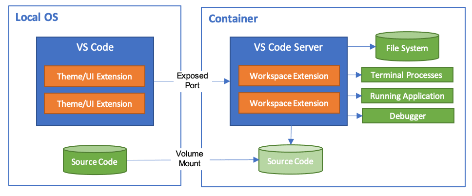
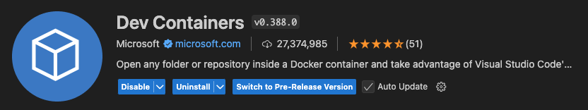
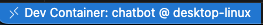

# What's a Dev Container?

The Visual Studio Code **Dev Containers** extension allows you to use a container as a fully-featured development environment. It enables you to open any folder inside (or mounted into) a container and leverage the complete feature set of Visual Studio Code.  

A `devcontainer.json` file in your project specifies how VS Code should access (or create) a development container with a predefined tool and runtime stack.

### Key Features:
- **Workspace Management**:  
  Workspace files can either be mounted from the local file system or copied/cloned into the container.  
- **Extension Integration**:  
  Extensions are installed and executed inside the container, providing them full access to the tools, platform, and file system within the container.  
- **Seamless Environment Switching**:  
  You can effortlessly switch your entire development environment by connecting to a different container.

This setup ensures a consistent and isolated development experience tailored to your project's needs.

1. **Install the Dev Containers extension**:  
   The Dev Containers extension allows Visual Studio Code to run inside a Docker container.  
   

2. **Verify the installation**:  
   Once installed, you'll notice a new **Remote Status bar item** on the far left of the Visual Studio Code Status bar.  
   

   This item indicates whether VS Code is running in a local or remote context. Clicking on it will bring up the Dev Containers commands.

3. **Reopen in container**:  
   When prompted, click **Reopen in Container** to start working in the development environment.
   Else, open the command palette with ``Ctrl / Cmd + Shift + P``. Then, enter and run Dev Containers: `Rebuild and Reopen in Container`"

4. **Wait for the container to build**:  
   The build process may take a few minutes.

5. **Verify the container**:  
   After the container has started and you're connected, confirm that your remote context has switched by checking the bottom-left corner of the VS Code Status bar.
   
   